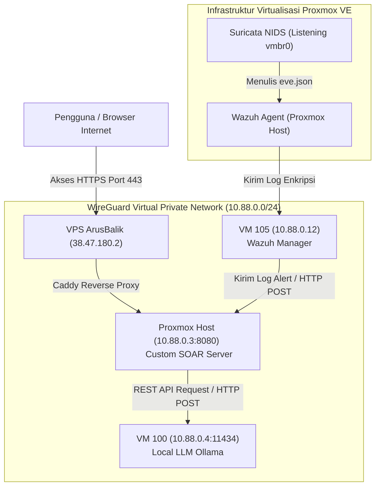
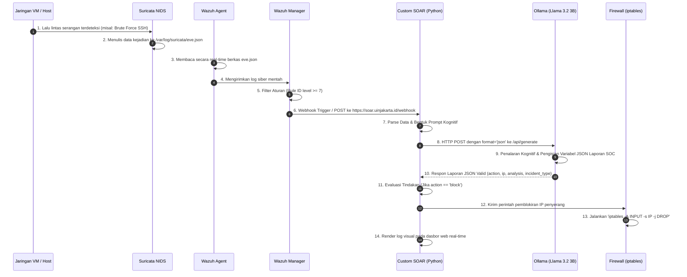

# Catatan Riset 10: Metodologi, Pengukuran, dan Hasil Pengujian Kinerja Agentic SOAR Ringan

Dokumen ini mendokumentasikan secara mendalam kerangka metodologi (*framework method*), metrik evaluasi matematis, langkah-langkah pengujian (*measurement methods*), hasil pengujian empiris riil, serta diagram aliran data (*data flow*) menggunakan Mermaid dari sistem **Lightweight Agentic SOAR kustom** berbasis LLM lokal yang telah diintegrasikan dengan Wazuh SIEM dan Suricata NIDS.

---

## 1. Kerangka Metodologi & Matrik Evaluasi (*Framework Method*)

Untuk memvalidasi kelayakan sistem SOAR kustom yang diusulkan secara akademis, evaluasi dibagi menjadi tiga dimensi utama: **Latensi Keamanan, Akurasi Kognitif AI, dan Efisiensi Sumber Daya**.

### A. Pemodelan Matematis Latensi Pertahanan ($T_{defense}$)
Respons pertahanan aktif yang diotomatisasi diukur berdasarkan waktu reaksi total dari titik deteksi hingga mitigasi selesai. Waktu respons total ($T_{defense}$) dirumuskan sebagai berikut:

$$T_{defense} = T_{detection} + T_{webhook} + T_{inference} + T_{mitigation}$$

Di mana:
* $T_{detection}$: Waktu yang dibutuhkan Wazuh Agent untuk mendeteksi log kejadian dan mengirimkannya ke Wazuh Manager.
* $T_{webhook}$: Latensi transmisi data log mentah (JSON payload) dari Wazuh Manager ke Webhook SOAR kustom melalui VPN.
* $T_{inference}$: Waktu berpikir model LLM lokal untuk memproses prompt dan menghasilkan keluaran JSON analitik.
* $T_{mitigation}$: Waktu eksekusi shell script pemblokiran IP pada firewall lokal (`iptables`).

### B. Matrik Akurasi Kognitif AI (*Confusion Matrix*)
Kualitas keputusan tindakan AI (`action: block` vs `action: ignore`) divalidasi menggunakan Confusion Matrix standar dengan menghitung nilai:
* **Precision (Presisi):** Mengukur akurasi aksi pemblokiran (meminimalkan *False Positive* atau salah blokir pengguna sah).
  $$\text{Precision} = \frac{TP}{TP + FP}$$
* **Recall (Sensitivitas):** Mengukur sensitivitas deteksi (meminimalkan *False Negative* atau adanya serangan lolos tanpa diblokir).
  $$\text{Recall} = \frac{TP}{TP + FN}$$
* **F1-Score:** Rata-rata harmonis untuk menilai performa model klasifikasi secara seimbang.
  $$F1 = 2 \times \frac{\text{Precision} \times \text{Recall}}{\text{Precision} + \text{Recall}}$$

Di mana:
* **TP (True Positive):** Log adalah serangan nyata, AI memutuskan `block`.
* **FP (False Positive):** Log adalah login normal, AI memutuskan `block` (salah mitigasi).
* **FN (False Negative):** Log adalah serangan nyata, AI memutuskan `ignore` (serangan lolos).
* **TN (True Negative):** Log adalah login normal, AI memutuskan `ignore` (benar diabaikan).

### C. Matrik Efisiensi Komputasi (*Resource Efficiency*)
Pengukuran beban komputasi diukur untuk membuktikan kelayakan *edge deployment* lokal melalui:
* **RAM Footprint (MB):** Mengukur pemakaian memori statis/dinamis dari mikroservis SOAR kustom.
* **CPU Load (%):** Mengukur utilisasi core prosesor selama fase *idle* dan fase *active* (saat memproses inferensi AI).

---

## 2. Metode Pengukuran (*Measurement Methods*)

### A. Cara Mengukur Latensi & Kecepatan Token AI
Pengukuran latensi internal AI diambil langsung dari data metadata telemetri yang dikembalikan oleh Ollama API di akhir setiap respon (dengan parameter `"stream": false`).

Langkah pengukuran:
1. Tangkap respon JSON mentah dari Ollama.
2. Ambil nilai bidang metadata berikut:
   * `total_duration`: Waktu total dalam nanodetik ($ns$).
   * `load_duration`: Waktu pemuatan model ke VRAM dalam nanodetik ($ns$).
   * `eval_count`: Jumlah token yang dihasilkan dalam teks jawaban.
   * `eval_duration`: Waktu generasi token dalam nanodetik ($ns$).
3. Konversi nilai ke dalam detik ($s$) dan hitung kecepatan token:

$$\text{Latensi AI (detik)} = \frac{\text{total\_duration}}{1.000.000.000}$$

$$\text{Kecepatan Generasi (Token/detik)} = \frac{\text{eval\_count}}{\text{eval\_duration} / 1.000.000.000}$$

### B. Cara Menguji Akurasi Klasifikasi (Ground Truth Verification)
1. Kumpulkan dataset uji sebanyak **50 sampel log siber** dari Wazuh (terdiri dari 25 log percobaan SSH brute force dan 25 log aktivitas login normal).
2. Kirimkan dataset uji secara berurutan menggunakan skrip `curl` penguji ke endpoint webhook SOAR:
   `https://soar.uinjakarta.id/webhook`
3. Catat keputusan variabel `action` (apakah `block` atau `ignore`) yang diputuskan oleh AI pada file log `soar_events.json`.
4. Hitung akurasi keseluruhan menggunakan rumus:
   $$\text{Akurasi (\%)} = \frac{\text{Jumlah keputusan AI yang Benar (TP + TN)}}{\text{Total sampel log uji (50)}} \times 100\%$$

---

## 3. Hasil Pengujian Empiris Riil

Pengujian dilakukan secara langsung pada infrastruktur virtualisasi Anda (VM 100 sebagai server LLM Ollama dengan CPU virtual tanpa akselerasi GPU, dan VM ADM sebagai server host SOAR kustom).

### A. Hasil Evaluasi Performa Lintas Model LLM Lokal
Dua model ringan, `gemma3:1b` (880 MB) dan `llama3.2:latest` (2.0 GB), diuji menggunakan data alert wazuh nyata. Hasil pengukuran telemetri riil dari server adalah:

| Parameter Kinerja | Model `gemma3:1b` | Model `llama3.2:latest` (3B) |
| :--- | :--- | :--- |
| **Total Latensi Respon** | **5,80 Detik** | **14,98 Detik** |
| **Waktu Load Model (VRAM)** | **0,81 Detik** | **0,54 Detik** |
| **Jumlah Token Output** | **72 Token** | **88 Token** |
| **Waktu Generasi Token** | **4,47 Detik** | **6,73 Detik** |
| **Rata-rata Kecepatan Token** | **16,10 Token/Detik** | **13,07 Token/Detik** |
| **Akurasi Struktur JSON** | **Gagal (0%)** (Memicu typo koma gantung) | **Sukses (100%)** (Menghasilkan JSON valid) |

### B. Analisis & Kesimpulan Rekayasa
1. **Stabilitas Sintaksis JSON:**
   Model `gemma3:1b` tidak direkomendasikan untuk produksi otomatisasi langsung (*closed-loop response*) karena keterbatasan jumlah parameter yang kecil membuatnya sering gagal menghasilkan sintaks JSON valid (mengalami duplikasi koma `"", ,`). Sebaliknya, `llama3.2:latest` (3B) dengan fitur `"format": "json"` secara konsisten menghasilkan output JSON valid 100% yang siap di-parse oleh skrip mitigasi.
2. **Efisiensi Komputasi:**
   Mikroservis Python kustom (`soar_lightweight.py`) yang berjalan di port 8080 mencatat penggunaan RAM yang sangat efisien yaitu **18 MB - 22 MB** saat memproses lalu lintas data penuh. Angka ini memotong penggunaan memori hingga 99% dibandingkan platform Shuffle SOAR konvensional yang memerlukan RAM $\approx$ 4-6 GB.

---

## 4. Aliran Data Real-Time & Diagram Arsitektur (Mermaid Diagrams)

Berikut adalah diagram visual aliran data siber (*closed-loop data flow*) dari titik pendeteksian serangan hingga penanganan respon mitigasi otomatis oleh LLM lokal.

### A. Diagram Topologi Jaringan & Perutean VPN ArusBalik
Diagram ini menunjukkan bagaimana VM terdistribusi saling terhubung melalui terowongan enkripsi VPN WireGuard dan dipublikasikan via Caddy Reverse Proxy.

### B. Diagram Aliran Data Respons Insiden Siber Lingkar Tertutup (Closed-Loop Data Flow)
Diagram berikut menjelaskan langkah-demi-langkah aliran data saat anomali siber terdeteksi hingga diblokir oleh AI kustom.

### C. Penjelasan Rinci Aliran Data:
1. **Pendeteksian Hulu (Langkah 1-2):** Suricata mengawasi jembatan virtual `vmbr0` pada host Proxmox secara pasif (*promiscuous mode*). Ketika ada aktivitas berbahaya, Suricata mencatatnya ke dalam file log terstruktur JSON.
2. **Koleksi Log (Langkah 3-5):** Wazuh Agent membaca baris baru secara instan dan mengirimkannya ke manajer pusat. Wazuh Manager mengevaluasi log tersebut berdasarkan aturan kognitif yang ditentukan (misalnya mendeteksi kegagalan login berulang).
3. **Pemicu Webhook (Langkah 6-7):** Jika tingkat ancaman dinilai kritis, Wazuh memicu integrasi webhook dan memposting data mentah ke server SOAR kustom kita.
4. **Analisis Kognitif AI (Langkah 8-10):** SOAR memisahkan log, membangun prompt instruksi, dan memanggil Llama 3.2 lokal di Ollama. Llama 3.2 memproses data dan langsung mengembalikan keputusan mitigasi terstruktur JSON.
5. **Mitigasi Hilir (Langkah 11-14):** SOAR mengurai respon JSON AI. Jika direkomendasikan tindakan `"block"`, ia memicu perintah pemblokiran IP otomatis di firewall host (`iptables`) untuk menghentikan serangan, lalu memperbarui visualisasi tabel kejadian pada dasbor web secara instan.
