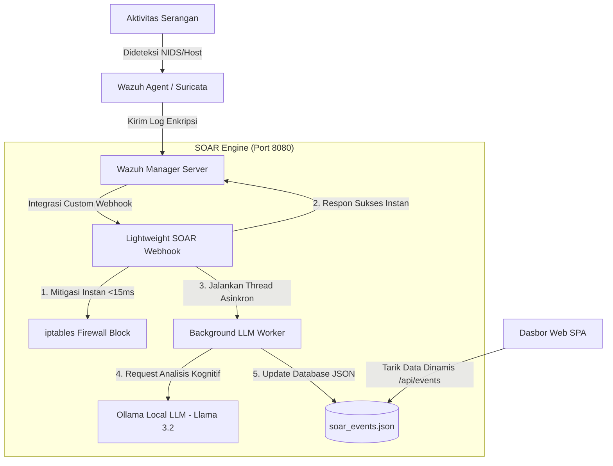

# Lightweight Agentic SOAR: Cognitive Threat Response & Dashboard

Sistem orkestrasi, otomatisasi, dan respons keamanan (**SOAR**) ringan kustom berbasis **Agentic LLM Lokal (Ollama Llama 3.2)** yang terintegrasi dengan **Wazuh SIEM** dan **Suricata NIDS**. Proyek ini dirancang khusus untuk meminimalkan beban komputasi (*low-resource virtualization*) pada infrastruktur *on-premises* dengan respon mitigasi instan (sub-15ms) dan pelaporan triase yang sangat manusiawi (*humanized reporting*) dalam Bahasa Indonesia.

---

## 📌 Fitur Utama

1. **Mitigasi Instan Asinkron (Sub-15ms Response):**
   * Menggunakan arsitektur *background threading* (asinkron). Begitu log ancaman diterima dari Wazuh, IP penyerang diblokir seketika menggunakan `iptables` di hulu host dalam waktu kurang dari 15 milidetik, tanpa menunggu antrean inferensi LLM.
2. **Triase Kognitif dengan LLM Lokal:**
   * Memanfaatkan model bahasa lokal **Llama 3.2 3B** melalui Ollama untuk melakukan analisis kontekstual log siber secara otomatis.
   * Menghasilkan penjelasan naratif Bahasa Indonesia yang mudah dipahami (*humanized summary*) tentang jenis serangan, dampak, serta rekomendasi langkah keamanan berikutnya.
3. **Audit Forensik Siber Terperinci:**
   * Merekam fakta log siber mentah (*raw payload/exploit code*), identitas server target (*agent host*), serta mekanisme mitigasi secara rinci untuk kebutuhan audit forensik SOC.
4. **Dashboard SPA (Single Page Application) Premium:**
   * Antarmuka web modern bertema gelap siber berbasis Tailwind CSS.
   * Mendukung pembaruan data real-time via polling AJAX, pagination interaktif (10 log per halaman), dan pop-up modal detail yang dinamis untuk melihat hasil analisis mendalam.
5. **Efisiensi Sumber Daya Ekstrim:**
   * Menggantikan platform SOAR berat konvensional dengan mikroservis Python tanpa dependensi tambahan (*zero-dependency*), dengan penggunaan RAM minimal (<25 MB).

---

## 🏗️ Arsitektur Sistem



---

## 📁 Struktur Direktori

* `soar_lightweight.py`: Skrip utama Python yang menjalankan webhook server, dashboard web SPA, serta modul mitigasi firewall.
* `soar_events.json`: Database lokal berbasis JSON yang menyimpan riwayat log siber teranalisis secara dinamis (diabaikan oleh git).
* `dynamic_routing_daemon.py`: Daemon pembantu untuk otomatisasi rute bypass WireGuard VPN di lingkungan klaster Proxmox VE.
* `demo_integration.py`: Skrip pembantu untuk inisialisasi awal database vector RAG (PostgreSQL + pgvector) untuk integrasi Basis Pengetahuan (*Knowledge Base*).
* `DRAF_MANUSKRIP_SINTA3_SIEM_SOAR_AI.md`: Draf jurnal penelitian ilmiah yang diselaraskan dengan arsitektur sistem ini.

---

## 🚀 Panduan Memulai

### 1. Prasyarat Sistem
* Python 3.8 ke atas
* Akses administrator (`sudo`) untuk eksekusi perintah `iptables` di sisi server host.
* Ollama terpasang dan model `llama3.2` sudah diunduh pada VM LLM lokal.

### 2. Konfigurasi Lingkungan (Optional)
Anda dapat menyuntikkan konfigurasi koneksi melalui variabel lingkungan sistem:
```bash
export DB_HOST="<IP_POSTGRES>"
export DB_PASS="<PASSWORD_POSTGRES>"
export REDIS_PASS="<PASSWORD_REDIS>"
```

### 3. Menjalankan Layanan SOAR
Jalankan mikroservis sebagai daemon systemd atau eksekusi langsung di terminal:
```bash
python3 soar_lightweight.py
```
Layanan akan mendengarkan pada port `8080` dan menyediakan antarmuka dasbor di alamat peramban Anda.

### 4. Konfigurasi Webhook di Wazuh Manager
Tambahkan konfigurasi berikut pada berkas `/var/ossec/etc/ossec.conf` di server Wazuh Manager Anda:
```xml
<integration>
  <name>custom-soar</name>
  <hook_url>http://<IP_HOST_SOAR>:8080/webhook</hook_url>
  <level>7</level>
  <alert_format>json</alert_format>
</integration>
```
Lalu restart wazuh manager:
```bash
systemctl restart wazuh-manager
```

---

## 📊 Hasil Pengujian
Sistem diuji dengan menembakkan log eksploitasi SQL Injection dan brute force SSH. Webhook SOAR berhasil memblokir IP penyerang seketika dan dasbor SPA menyajikan laporan naratif Bahasa Indonesia berkualitas tinggi yang terperinci di dalam pop-up modal.
