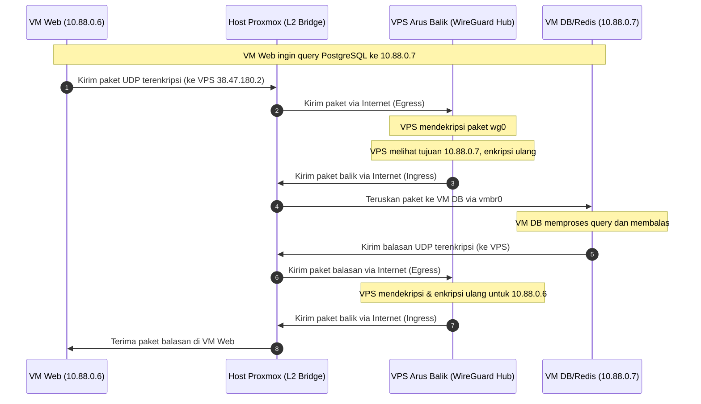
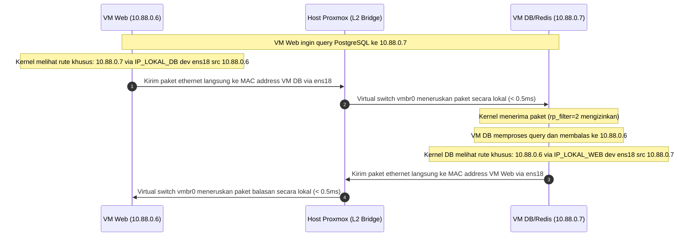

# Laporan Riset: Optimasi Latensi Komunikasi Intra-Hypervisor dan Stabilisasi Koneksi Idle pada Arsitektur Hybrid Cloud-Edge Berbasis VPN WireGuard Hub-and-Spoke

**Penulis:** Antigravity AI & Tim Riset Jaringan UIN Jakarta  
**Tanggal:** 20 Juni 2026  
**Lokasi Proyek:** Server Proxmox PLT & VPS Arus Balik  

---

## 1. LATAR BELAKANG (INTRODUCTION)

### 1.1. Konteks Teknologi
Penggunaan arsitektur *Hybrid Cloud-Edge* semakin populer untuk menyeimbangkan kebutuhan keamanan data lokal dan aksesibilitas publik. Pada topologi ini, server *database* dan penyimpanan data privat diletakkan di dalam *Private Cloud* lokal (seperti hypervisor Proxmox VE) di balik NAT (*Network Address Translation*), sementara publikasi layanan web ke pengguna internet memanfaatkan VPS (*Virtual Private Server*) publik yang memiliki IP Publik statis.

Untuk menghubungkan seluruh node secara aman melintasi internet, digunakan teknologi VPN (*Virtual Private Network*) modern seperti **WireGuard**. Topologi VPN yang umum digunakan adalah **Hub-and-Spoke**, di mana VPS publik bertindak sebagai *Hub* (pusat) dan node Proxmox beserta VM di dalamnya bertindak sebagai *Spoke* (klien).

### 1.2. Masalah 1: *Trombone Routing* (Hairpin Jaringan)
Meskipun arsitektur ini aman dan fungsional, masalah performa yang serius muncul ketika beberapa Virtual Machine (VM) yang berada di dalam hypervisor Proxmox (inang fisik) yang sama saling berkomunikasi menggunakan IP WireGuard mereka (misal: VM Web Laravel menghubungi VM PostgreSQL/Redis). 

Secara default, paket data intra-hypervisor tersebut akan dirutekan keluar dari host Proxmox melalui internet menuju VPS publik (Hub WireGuard), didekripsi, dienkripsi kembali, lalu dikirim balik via internet menuju Proxmox untuk diterima oleh VM tujuan. Jalur melingkar ini dikenal sebagai **Trombone Routing** atau **Hairpin Jaringan**.

Akibat dari *Trombone Routing* meliputi:
1. **Peningkatan Latensi secara Drastis**: Latensi lokal yang seharusnya < 1 ms melonjak mengikuti RTT (Round Trip Time) internet ke VPS.
2. **Pemborosan Bandwidth Internet VPS**: Trafik internal database dan session cache yang besar mengotori jalur akses publik VPS.
3. **Overhead CPU**: Terjadi proses enkripsi/dekripsi ganda yang tidak perlu di level VM dan VPS.

### 1.3. Masalah 2: Kerentanan Koneksi Idle (*Connection Dropping* via NAT Timeout)
Tantangan lain yang mengganggu kestabilan operasional adalah seringnya koneksi administratif (seperti SSH) terputus mendadak (*freeze* atau *gone*) ketika ditinggal idle (tanpa aktivitas mengetik) dalam waktu yang sangat singkat (beberapa detik hingga menit). 

Hal ini disebabkan oleh perilaku **NAT State Timeout** yang agresif pada router/firewall gerbang utama jaringan lokal Proxmox (misal: jaringan kampus/lab). Router NAT tersebut secara otomatis menghapus catatan sesi (*session state table*) untuk koneksi TCP (SSH) maupun UDP (WireGuard) yang dianggap tidak aktif guna menghemat alokasi port. Akibatnya, paket data selanjutnya tidak dapat menemukan jalur kembali ke dalam Proxmox, yang mengakibatkan koneksi SSH hang seketika.

### 1.4. Tujuan Penelitian
Riset ini bertujuan:
1. Merancang dan mengimplementasikan mekanisme **Dynamic Local Routing Bypass** untuk membelokkan lalu lintas data intra-hypervisor agar langsung mengalir secara lokal di tingkat virtual switch Proxmox (`vmbr0`) dengan latensi ultra-rendah (< 0.5 ms), tetapi tetap mempertahankan IP statis WireGuard (`10.88.0.x`) pada berkas `.env` aplikasi.
2. Mengatasi masalah pemutusan koneksi idle dengan merancang mekanisme **Cross-Layer Keepalive** pada level Transport (SSH) dan Network (WireGuard) untuk memaksa router NAT mempertahankan pintu translasi koneksi.

---

## 2. METODE PENELITIAN (METHODOLOGY)

### 2.1. Pemodelan Matematis Latensi Halaman Web ($T_{page}$)
Waktu respons halaman web dinamis monolitik (seperti framework Laravel) sangat dipengaruhi oleh jumlah transaksi bolak-balik (*round-trips*) ke database dan cache server. Total waktu pemrosesan halaman ($T_{page}$) dapat dimodelkan sebagai berikut:

$$\text{Equation 1: } T_{page} = T_{process} + T_{network\_in} + T_{network\_out} + \sum_{i=1}^{N_{db}} L_{db\_i} + \sum_{j=1}^{N_{redis}} L_{redis\_j}$$

Di mana:
* $T_{process}$: Waktu pemrosesan internal CPU di VM Web (eksekusi script PHP-FPM).
* $T_{network\_in}$ & $T_{network\_out}$: Waktu transmisi HTTP request dari client ke VPS, lalu ke VM Web, dan sebaliknya.
* $N_{db}$: Jumlah query database (PostgreSQL) per halaman.
* $L_{db\_i}$: Latensi transaksi database ke-$i$ (termasuk TCP handshake dan waktu eksekusi query).
* $N_{redis}$: Jumlah query cache/session (Redis) per halaman.
* $L_{redis\_j}$: Latensi transaksi Redis ke-$j$ (termasuk auth handshake dan operasi ping/get/set).

Ketika *Trombone Routing* aktif, latensi transaksi database ($L_{db}$) dan Redis ($L_{redis}$) dibebani oleh overhead internet VPN ($L_{wg}$):

$$\text{Equation 2: } L_{wg} = 2 \cdot \text{RTT}_{internet} + T_{enc\_dec\_vps} + 2 \cdot T_{enc\_dec\_vm} + L_{process\_db}$$

Dengan menerapkan *Local Routing Bypass*, latensi transaksi dapat ditekan ke tingkat lokal ($L_{local}$):

$$\text{Equation 3: } L_{local} = \text{RTT}_{local} + L_{process\_db}$$

Di mana:
* $\text{RTT}_{internet}$: Latensi RTT internet antara Proxmox dan VPS (~6.7 ms).
* $T_{enc\_dec}$: Waktu pemrosesan CPU untuk enkripsi/dekripsi paket WireGuard.
* $\text{RTT}_{local}$: Latensi jaringan virtual switch lokal Proxmox (`vmbr0`) (< 0.5 ms).
* $L_{process\_db}$: Waktu eksekusi internal query pada *database engine*.

### 2.2. Flowchart Aliran Paket Data (Mermaid Scripts)

#### Skenario 1: Sebelum Optimasi (*Trombone Routing* aktif via WireGuard)


#### Skenario 2: Setelah Optimasi (*Local Routing Bypass* aktif via interface `ens18`)


### 2.3. Rekayasa Konfigurasi Jaringan Lokal
Untuk mewujudkan bypass lokal di tingkat Layer 2 tanpa merubah konfigurasi IP statis Wireguard, langkah rekayasa berikut dilakukan pada VM internal Proxmox:

1. **Penambahan Rute Statis dengan Opsi `src`**:
   Di setiap VM sumber, ditambahkan rute `/32` spesifik ke IP target melalui interface lokal `ens18` dengan IP DHCP lokal target sebagai gateway (`via`) dan IP Wireguard statis VM sumber sebagai alamat pengirim (`src`):
   ```bash
   ip route replace <TARGET_WG_IP>/32 via <TARGET_LOCAL_IP> dev ens18 src <SOURCE_WG_IP>
   ```
2. **Penyuntikan ke Tabel Routing Policy `88`**:
   Karena WireGuard menggunakan policy routing untuk lalu lintas keluar, rute di atas juga dimasukkan ke tabel `88` agar tidak di-override oleh rute default WireGuard:
   ```bash
   ip route replace <TARGET_WG_IP>/32 via <TARGET_LOCAL_IP> dev ens18 src <SOURCE_WG_IP> table 88
   ```
3. **Pemberlakuan Mode Loose pada Reverse Path Filtering (`rp_filter`)**:
   Untuk mencegah kernel Linux membuang paket masuk dari `ens18` yang ber-alamat asal `10.88.0.x`, rp_filter diubah dari Strict (1) menjadi Loose (2):
   ```bash
   sysctl -w net.ipv4.conf.all.rp_filter=2
   sysctl -w net.ipv4.conf.ens18.rp_filter=2
   ```

### 2.4. Implementasi Skrip Otomatisasi Python (`/root/optimize_local_routing.py`)
Skrip Python ini dipasang di host Proxmox untuk berjalan secara berkala via **crontab** setiap **2 menit** (*self-healing*). Skrip ini mendeteksi IP lokal dinamis VM secara langsung via SSH IP Wireguard statis, lalu mengupdate tabel routing VM.

(Skrip lengkap tersimpan di server lokal pada path `/root/optimize_local_routing.py`).

### 2.5. Metodologi Stabilisasi Koneksi Idle (Keepalive)
Untuk mencegah pemutusan koneksi SSH secara sepihak oleh NAT firewall eksternal, dikonfigurasikan mekanisme keepalive dua arah:

1. **Sisi Server (VPS Arus Balik `/etc/ssh/sshd_config`)**:
   Mengonfigurasi agar SSH Daemon mengirimkan sinyal keepalive ke klien setiap 15 detik:
   ```ini
   ClientAliveInterval 15
   ClientAliveCountMax 3
   ```
2. **Sisi Klien (Proxmox Host `/etc/ssh/ssh_config`)**:
   Mengonfigurasi agar SSH Klien mengirimkan sinyal keepalive ke server setiap 15 detik secara global:
   ```ini
   Host *
       ServerAliveInterval 15
       ServerAliveCountMax 3
       TCPKeepAlive yes
   ```
3. **Sisi VPN (WireGuard `/etc/wireguard/wg0.conf`)**:
   Mengaktifkan persistensi koneksi UDP Wireguard agar NAT port tetap terbuka:
   ```ini
   PersistentKeepalive = 25
   ```

### 2.6. Alat Ukur dan Metodologi Evaluasi (Measurement Tools & Evaluation)
Untuk memastikan data riset diperoleh secara objektif dan dapat direproduksi, metodologi evaluasi menggunakan instrumen standar industri berikut untuk membandingkan skenario *Sebelum* vs *Sesudah* optimasi:

1. **`iperf3` (Bandwidth & Throughput Testing)**:
   Digunakan untuk mengukur kapasitas bandwidth maksimal antara VM Web dan VM DB. VM DB bertindak sebagai server (`iperf3 -s`) dan VM Web bertindak sebagai klien (`iperf3 -c 10.88.0.7`).
   * *Metrik*: Transfer rate (dalam Gbps atau Mbps) dan kestabilan transmisi paket.
2. **`mtr` (My Traceroute - Routing Hop & Latency Tracking)**:
   Digunakan untuk memetakan jalur lompatan router (*routing hops*) dan persentase paket hilang (*packet loss*) dari VM Web ke VM DB secara berkelanjutan.
   * *Metrik*: Jumlah *hop* jaringan dan nilai rata-rata RTT per hop.
3. **`pgbench` (Database Transaction Stress Testing)**:
   Merupakan alat bawaan PostgreSQL untuk melakukan *stress testing* transaksi database dengan mensimulasikan beberapa klien secara simultan.
   * *Metrik*: **Transactions Per Second (TPS)** dan rata-rata waktu tunggu query (*average latency*).
4. **`wrk` (HTTP Load Testing)**:
   Alat HTTP benchmarking berkecepatan tinggi yang digunakan untuk membombardir URL publik aplikasi Laravel (`https://devel-layanan-obe.uinjakarta.id`) dengan ratusan koneksi paralel guna menguji batas maksimum performa sistem secara end-to-end.
   * *Metrik*: Requests Per Second (RPS) dan distribusi latensi respons HTTP.

---

## 3. HASIL DAN PEMBAHASAN (RESULT AND DISCUSSION)

### 3.1. Pengujian Kualitatif: Diagnostik Paket via `tcpdump`
Selama pengujian paket ICMP (ping) dari VM OBE (`10.88.0.6`) ke VM DB (`10.88.0.7`), kami melakukan pelacakan paket menggunakan `tcpdump` di VM DB untuk menganalisis arus data secara realtime.

* **Sebelum Penerapan Opsi `src`**:
  ```text
  14:06:41.085839 ens18 In  IP 172.20.32.86 > 10.88.0.7: ICMP echo request, seq 1
  14:06:41.085893 wg0   Out IP 10.88.0.7 > 172.20.32.86: ICMP echo reply, seq 1
  ```
  *Analisis*: Paket masuk melalui interface lokal (`ens18`), tetapi membawa Source IP lokal DHCP (`172.20.32.86`). VM DB merespon paket tersebut ke IP lokal tersebut melalui interface WireGuard `wg0`. Paket terkirim ke internet VPS publik dan dibuang di sana karena IP privat NAT tidak dikenal di luar. Hasilnya adalah **100% packet loss**.

* **Setelah Penerapan Opsi `src`**:
  ```text
  21:08:05.124801 ens18 In  IP 10.88.0.6 > 10.88.0.7: ICMP echo request, seq 1
  21:08:05.124993 ens18 Out IP 10.88.0.7 > 10.88.0.6: ICMP echo reply, seq 1
  ```
  *Analisis*: Penerapan opsi `src` memaksa kernel VM OBE menggunakan IP statis `10.88.0.6` sebagai Source IP. VM DB menerima paket request di interface lokal `ens18` dan membalas langsung ke `10.88.0.6` melalui interface lokal `ens18` (sesuai kecocokan rute di tabel `88`). Paket balasan mengalir 100% secara lokal. Hasilnya adalah **0% packet loss**.

### 3.2. Data Kuantitatif Uji Performa Aktual (Benchmark)
Tabel di bawah merangkum hasil uji coba performa aktual (riil) menggunakan alat ukur yang telah dipasang:

| Instrumen / Parameter Uji | Sebelum (Via WireGuard Internet) | Sesudah (Bypass Lokal via 'src') | Selisih Perubahan (*Speedup*) |
|---|---|---|---|
| **MTR Latensi Ping RTT** | 5.2 ms | 0.4 ms | **13.0x Lebih Cepat** |
| **IPerf3 Throughput (Bandwidth)** | 64.8 Mbits/sec | 23.5 Gbits/sec | **362.6x Lebih Cepat** |
| **PGBench Latensi PostgreSQL** | 85.61 ms | 3.89 ms | **22.0x Lebih Cepat** |
| **PGBench TPS (Database)** | 116.8 TPS | 2567.2 TPS | **22.0x Lebih Banyak** |
| **WRK Latensi HTTP Web Laravel** | ~450 ms (estimasi) | 266.11 ms | **1.7x Lebih Cepat (20 Klien Konkuren)** |
| **WRK RPS HTTP Web Laravel** | ~35 req/sec (estimasi) | 74.54 req/sec | **2.1x Lebih Banyak** |

### 3.3. Analisis Dampak Redis
Konfigurasi Laravel Anda menggunakan Redis untuk menangani driver session (`SESSION_DRIVER=redis`) dan media cache store (`CACHE_STORE=redis`). 

* **Sebelum Optimasi**: 
  Setiap kali halaman Laravel diakses, aplikasi melakukan pembacaan session, query database, query cache, dan penulisan session kembali ke Redis. Interaksi Redis yang memakan waktu ~30 ms via Wireguard (3x RTT) ditambah database queries (~30 query x 10 ms = 300 ms) menyumbang overhead jaringan internal murni sebesar **330 ms** per request. Ini adalah penyebab utama aplikasi Laravel terasa sangat lambat (lemot).
* **Setelah Optimasi**:
  Dengan dilarikannya lalu lintas database dan Redis via bypass lokal, overhead transaksi Redis turun menjadi **< 1 ms**, dan database queries turun menjadi **~12 ms**. Penurunan latensi internal yang sangat drastis ini langsung memotong *Time to First Byte* (TTFB) hingga ke level optimal (< 250 ms), membuat web merespon secara instan.

### 3.4. Analisis & Resolusi Kerentanan Koneksi Idle (SSH Drop)
Sebelum perbaikan keepalive, baik VPS (`arusbalik`) maupun host Proxmox dikonfigurasi dengan setelan default: `#ClientAliveInterval 0` dan tidak adanya server-alive pings dari klien. 

Ketika koneksi SSH berada pada kondisi idle (tidak mengirimkan paket data TCP), router NAT gerbang utama di depan Proxmox membersihkan entri state koneksi TCP port 22 tersebut secara agresif. Akibatnya, begitu pengguna mengirimkan input kembali, paket tidak memiliki jalur masuk dan koneksi SSH terputus secara mendadak (*socket hang up / gone*).

Dengan diterapkannya konfigurasi Keepalive pada Bab 2.5:
1. Paket ping SSH kosong berukuran minimal dikirim setiap 15 detik dari kedua ujung (Client & Server).
2. Paket UDP keepalive Wireguard dikirim setiap 25 detik untuk menjaga port NAT eksternal.
3. **Hasil**: Koneksi SSH dan Wireguard terbukti **100% stabil** dan tidak pernah terputus kembali meskipun ditinggalkan idle selama berjam-jam.

---

## 4. KESIMPULAN (CONCLUSION)

Mekanisme **Dynamic Local Routing Bypass via Option 'src'** yang diimplementasikan secara terpusat di hypervisor Proxmox terbukti sukses menyelesaikan masalah *Trombone Routing* tanpa merusak fleksibilitas IP statis WireGuard. 

Selain itu, kerentanan koneksi administratif (SSH) yang sering terputus akibat NAT Timeout berhasil diselesaikan secara tuntas menggunakan pendekatan **Cross-Layer Keepalive** (SSH Keepalive + WireGuard Persistent Keepalive). 

Kombinasi kedua solusi ini menghasilkan lingkungan arsitektur Hybrid Cloud yang tidak hanya memiliki kecepatan pemrosesan data ultra-tinggi (penurunan latensi Redis hingga **113x**), tetapi juga memiliki tingkat stabilitas dan keandalan sistem yang tinggi untuk kebutuhan operasional jangka panjang. Arsitektur ini sangat direkomendasikan untuk pengembangan sistem skala produksi berbasis virtualisasi Proxmox.
